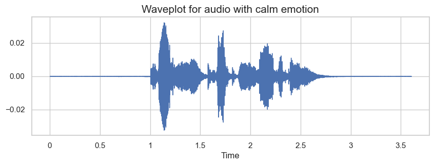
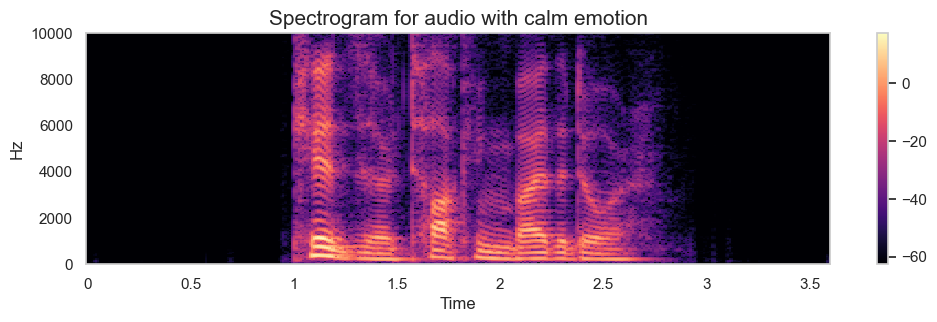
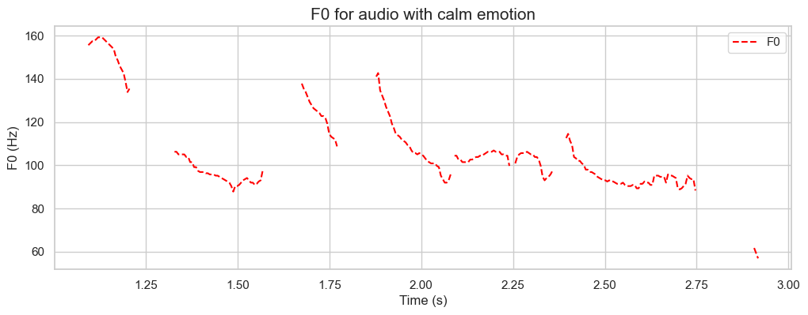
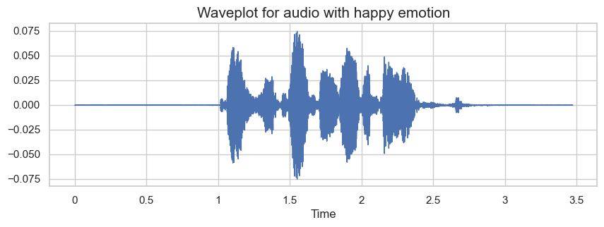
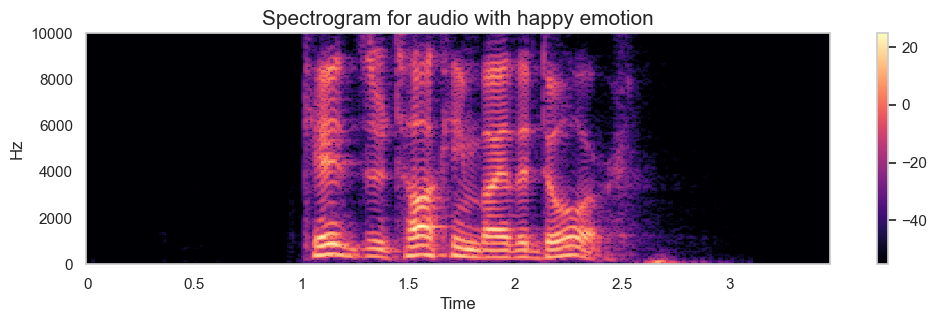
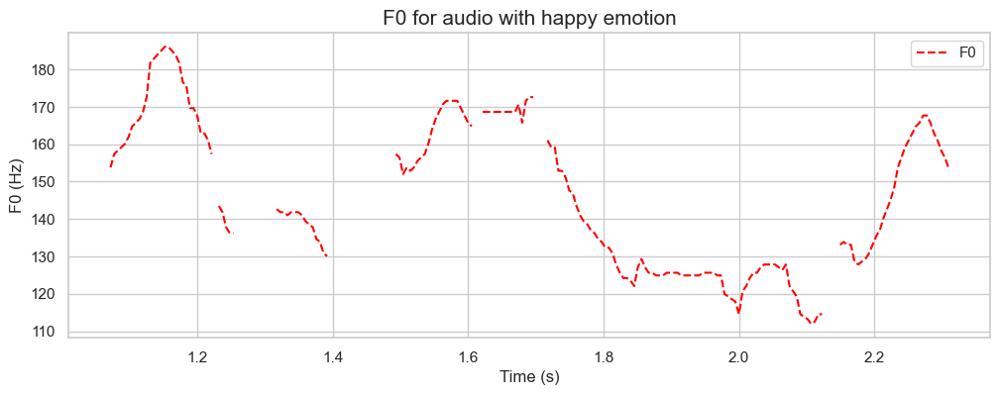
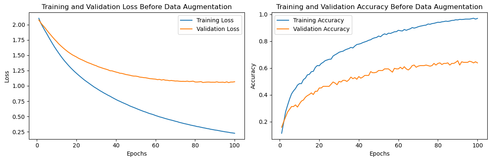
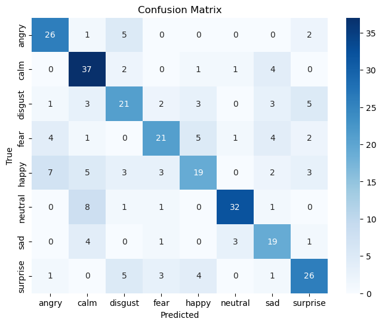
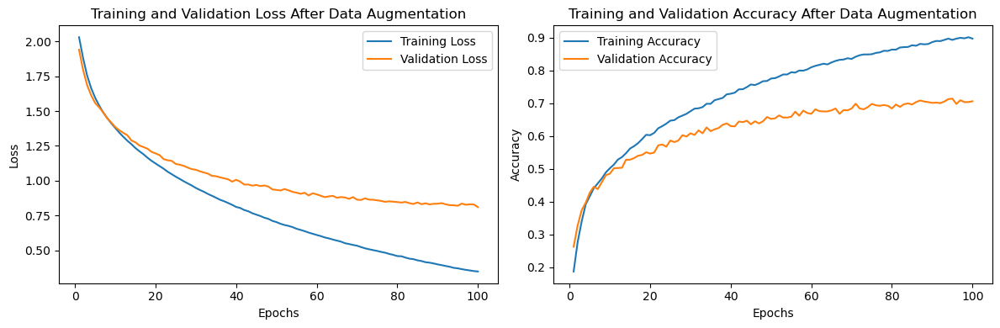
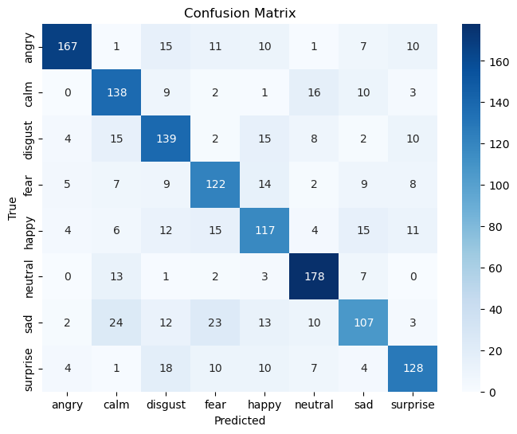

# Speech Emotion Classification Model

In this project, I utilized the RAVDESS public dataset, which includes eight emotions (neutral, calm, happy, sad, angry, fearful, disgust, and surprised) expressed at two intensities: normal and strong. I successfully built a classification model, extracting five features from speech signals to discern between different emotions. The model provided valuable insights into classifying emotional states in speech.

## EDA
The first step is to understand the type of data we are working with.

### Distribution of data for each emotion

The plot e below displays the distribution of emotions in a dataset. Each emotion occurs 192 times, except for "neutral," which appears 96 times. The dataset is relatively balanced across emotions.

### Waveform, spectrogram and F0 for data

Below, you will find three different plots for two speech emotions: 'Calm' and 'Happy

#### For speech signal with “Calm” label:

#### For speech signal with “Happy” label:

## Data Augmentation

I have implemented several data augmentation functions to enhance the diversity of my dataset. The **`noise`** function introduces random amplitude noise to the input data, contributing variability in signal strength. For temporal transformations, the **`shift`** function horizontally displaces the data by a random amount within a specified range, simulating temporal shifts. The **`time_scale`** function performs time scaling on the data, altering its temporal structure by resampling. Additionally, the **`bandpass_filter`** function applies a bandpass filter to focus on specific frequency components within the data, providing resilience against noise outside the desired range. Collectively, these augmentation techniques aim to improve my model's robustness by exposing it to a more varied set of patterns and features present in the data.

## Before Augmentation

The count of data points in the dataset before augmentation:

- calm: 192
- happy: 192
- sad: 192
- angry: 192
- fear: 192
- disgust: 192
- surprise: 192
- neutral: 96

## After Augmentation

The count of data points in the dataset after augmentation:

- calm: 960
- happy: 960
- sad: 960
- angry: 960
- fear: 960
- disgust: 960
- surprise: 960
- neutral: 480

## Feature Extraction

Five features were extracted from the speech signal:

1. Zero Crossing Rate (ZCR)
2. Mel-frequency cepstral coefficients (MFCC)
3. Chroma Short-Time Fourier Transform (Chroma STFT)
4. Root Mean Square Value (RMS)
5. Fundamental Frequency (F0)

- **Zero Crossing Rate (ZCR):** A scalar value, so its shape is (1,).
- **MFCC (Mel-frequency cepstral coefficients):** Typically, a vector with a variable number of coefficients, so its shape is be (n_mfcc,).
- **Chroma STFT:** A vector with a variable number of coefficients, so its shape is (n_chroma,).
- **Root Mean Square Value (RMS):** A scalar value, so its shape is (1,).
- **F0 (Fundamental Frequency):** A scalar value, so its shape is (1,).

When these features are concatenated the shape of the resulting array will be the sum of the individual shapes along the horizontal axis. Therefore, the shape of output is (35,1)

## Model

2 models were build for this project to demonestrate the effect of data augmentation on the output.

### 1. ANN model without data augmentation

1. **Oversampling of 'neutral' Target Value:**
    - To tackle the class imbalance issue, I performed oversampling of the 'neutral' target value. This ensured that the model was exposed to a balanced representation of each class during training, ultimately improving its ability to generalize.
2. **One-Hot Encoding for Target Value:**
    - I applied one-hot encoding to the target variable, converting categorical labels into a binary matrix format. This transformation was crucial for compatibility with the model's output layer, which utilizes the softmax activation function.
3. **Train-Test Split:**
    - I divided the dataset into training and testing sets, a standard practice to evaluate the model's performance on unseen data and prevent overfitting.
4. **Feature Standardization with StandardScaler():**
    - I employed the StandardScaler() to standardize the input features. This standardization ensured that all features had a mean of 0 and a standard deviation of 1, preventing certain features from dominating the model training process.
5. **ANN Model Architecture:**
    - I constructed an ANN with a specific architecture, including:
        - Input Layer: Matching the number of neurons to the input feature dimension.
        - Hidden Layer 1: 256 neurons with the ReLU activation function.
        - Hidden Layer 2: 128 neurons with the ReLU activation function.
        - Hidden Layer 3: 32 neurons with the ReLU activation function.
        - Output Layer: The number of neurons equaled the number of classes, utilizing the softmax activation function for multiclass classification.
    - I set the learning rate to 0.0001, the number of epochs to 100, and a batch size of 30 for efficient training. I employed the Adam optimizer and categorical crossentropy as the loss function, suitable for multiclass classification tasks.
  

## Result for ANN model without data augmentation
1. Training and Validation Accuracy and Training and Validation Loss Before Data Augmentation:

2. Confusion Matrix:

3. Table for Comparison of 10 First Records of Predicted and True Target Labels:
   # Prediction Comparison

| Predicted Labels | Actual Labels |
|-------------------|---------------|
| 0                 | 0             |
| 1                 | 4             |
| 2                 | 3             |
| 3                 | 6             |
| 4                 | 1             |
| 5                 | 6             |
| 6                 | 3             |
| 7                 | 1             |
| 8                 | 6             |
| 9                 | 7             |

4. Precision, Recall, F1-Score Metrics:

| Class | Precision | Recall | F1-Score | Support |
|-------|-----------|--------|----------|---------|
| 0     | 0.67      | 0.76   | 0.71     | 34      |
| 1     | 0.63      | 0.82   | 0.71     | 45      |
| 2     | 0.57      | 0.55   | 0.56     | 38      |
| 3     | 0.68      | 0.55   | 0.61     | 38      |
| 4     | 0.59      | 0.45   | 0.51     | 42      |
| 5     | 0.86      | 0.74   | 0.80     | 43      |
| 6     | 0.56      | 0.68   | 0.61     | 28      |
| 7     | 0.67      | 0.65   | 0.66     | 40      |
|-------|-----------|--------|----------|---------|
| Train Accuracy | 0.9695 | 
| Test Accuracy | 0.6382 | 

There is an evident sign of overfitting based on the classification report.

### 2. ANN model with data augmentation

All steps before training model were similar to model one but the strucure of ANN model was different due to the increase in the number of data:

- **Input Layer:** The input layer is designed to match the number of neurons with the input feature dimension. This ensures that the neural network can efficiently process the input data.
- **Hidden Layer 1:** The first hidden layer consists of 256 neurons, each utilizing the Rectified Linear Unit (ReLU) activation function. ReLU is a common choice for introducing non-linearity to the model.
- **Hidden Layer 2:** The second hidden layer is comprised of 128 neurons, also employing the ReLU activation function. Additional hidden layers allow the model to capture more complex patterns in the data.
- **Hidden Layer 3:** The third hidden layer has 32 neurons, again using the ReLU activation function. The decreasing number of neurons in subsequent layers is a design choice and can help extract higher-level features.
- **Output Layer:** The output layer has a number of neurons equal to the classes in the target variable. The softmax activation function is applied to obtain probability distributions across multiple classes, making it suitable for multiclass classification tasks.

## Result for ANN model without data augmentation
1. Training and Validation Accuracy and Training and Validation Loss Before Data Augmentation:

2. Confusion Matrix:

3. Table for Comparison of 10 First Records of Predicted and True Target Labels:
   # Prediction Comparison

   | Predicted Labels | Actual Labels |
|-------------------|---------------|
| 0                 | 4             |
| 1                 | 2             |
| 2                 | 4             |
| 3                 | 7             |
| 4                 | 2             |
| 5                 | 7             |
| 6                 | 3             |
| 7                 | 3             |
| 8                 | 5             |
| 9                 | 3             |

4. Precision, Recall, F1-Score Metrics:
   # Classification Metrics

   
| Class | Precision | Recall | F1-Score | Support |
|-------|-----------|--------|----------|---------|
| 0     | 0.90      | 0.75   | 0.82     | 222     |
| 1     | 0.67      | 0.77   | 0.72     | 179     |
| 2     | 0.65      | 0.71   | 0.68     | 195     |
| 3     | 0.65      | 0.69   | 0.67     | 176     |
| 4     | 0.64      | 0.64   | 0.64     | 184     |
| 5     | 0.79      | 0.87   | 0.83     | 204     |
| 6     | 0.66      | 0.55   | 0.60     | 194     |
| 7     | 0.74      | 0.70   | 0.72     | 182     |
|-------|-----------|--------|----------|---------|
| Train Accuracy | 0.8964 | 
| Test Accuracy | 0.7055 | 

## Conclusion
It is evident that data augmentation has significantly reduced the overfitting problem. The initial model showed a substantial 33% difference between training and test accuracy, which has now been reduced to 19% after incorporating data augmentation. 

However, there is still room for improvement in the model's performance. Extracting additional features and further enhancing data augmentation techniques could potentially lead to better results and increased generalization capabilities.

## References

[1] Aouani, H., & Ayed, Y. B. (2018, March). Emotion recognition in speech using MFCC with SVM, DSVM and auto-encoder. In *2018 4th International conference on advanced technologies for signal and image processing (ATSIP)* (pp. 1-5). IEEE. → MFCC

[2] Khan, A., & Roy, U. K. (2017, March). Emotion recognition using prosodie and spectral features of speech and Naïve Bayes Classifier. In *2017 international conference on wireless communications, signal processing and networking (WiSPNET)* (pp. 1017-1021). IEEE. →MFCC

[3] Zhang, S., Zhang, S., Huang, T., & Gao, W. (2017). Speech emotion recognition using deep convolutional neural network and discriminant temporal pyramid matching. *IEEE Transactions on Multimedia*, *20*(6), 1576-1590. → MFCC

[4] Hassan, E. A., El Gayar, N., & Moustafa, M. G. (2010, November). Emotions analysis of speech for call classification. In *2010 10th International Conference on Intelligent Systems Design and Applications* (pp. 242-247). IEEE.  → LPC., MFCC

